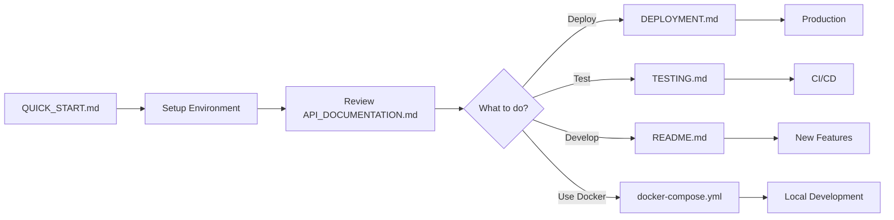

# Courier Management System - Documentation Index

Complete documentation for the Courier Management System. Start here to navigate all guides.

## 📚 Documentation Files

### Getting Started
- **[QUICK_START.md](QUICK_START.md)** ⚡ 
  - 5-minute setup guide
  - Backend and frontend installation
  - First steps after setup
  - Common commands
  - Troubleshooting

### Core Documentation
- **[README.md](README.md)** 📖
  - Project overview
  - Technology stack
  - Features summary
  - Architecture overview
  - Deployment checklist
  - Contributing guidelines

- **[API_DOCUMENTATION.md](API_DOCUMENTATION.md)** 🔗
  - Complete API endpoint reference
  - Authentication details
  - Request/response examples
  - Parcel workflow walkthrough
  - Filtering and searching
  - Error handling
  - Status codes
  - Role-based permissions

### Deployment & Operations
- **[DEPLOYMENT.md](DEPLOYMENT.md)** 🚀
  - Production deployment guide
  - Server setup instructions
  - PostgreSQL configuration
  - Gunicorn and systemd setup
  - Nginx reverse proxy configuration
  - SSL/HTTPS with Let's Encrypt
  - Backup and maintenance
  - Monitoring and logging
  - Scaling considerations
  - Security hardening
  - Troubleshooting

### Testing & Quality
- **[TESTING.md](TESTING.md)** ✅
  - Unit tests for models and views
  - Integration testing with Postman
  - Frontend testing with Jest
  - Performance testing
  - CI/CD with GitHub Actions
  - Test coverage goals
  - Test data management

### Containerization
- **[docker-compose.yml](docker-compose.yml)** 🐳
  - Complete containerization setup
  - Services: PostgreSQL, Redis, Django, React, Celery, Nginx
  - Health checks and volume management
  - Development and production ready

- **[Dockerfile](Dockerfile)** 🐳
  - Django application container
  - Multi-stage builds
  - Security best practices

- **[frontend/Dockerfile](frontend/Dockerfile)** 🐳
  - React application container
  - Nginx production server

- **[nginx.conf](nginx.conf)** 🔧
  - Reverse proxy configuration
  - Static/media file serving
  - API proxying
  - WebSocket support

### Configuration Templates
- **[.env.example](.env.example)**
  - Backend environment variables template
  - Database configuration
  - Security settings
  - Email configuration

- **[frontend/.env.example](frontend/.env.example)**
  - Frontend environment variables template
  - API URL configuration

## 🚀 Quick Navigation

### I want to...

**Get started immediately**
→ [QUICK_START.md](QUICK_START.md)

**Deploy to production**
→ [DEPLOYMENT.md](DEPLOYMENT.md)

**Understand the API**
→ [API_DOCUMENTATION.md](API_DOCUMENTATION.md)

**Set up testing**
→ [TESTING.md](TESTING.md)

**Use Docker**
→ [docker-compose.yml](docker-compose.yml)

**Learn about the system**
→ [README.md](README.md)

**Configure the environment**
→ [.env.example](.env.example)

## 📋 Project Structure

```
courier-system/
├── QUICK_START.md              ← Start here!
├── README.md                   ← Project overview
├── API_DOCUMENTATION.md        ← API reference
├── DEPLOYMENT.md               ← Production guide
├── TESTING.md                  ← Testing guide
├── docker-compose.yml          ← Container setup
├── Dockerfile                  ← Django container
├── nginx.conf                  ← Reverse proxy
├── .env.example                ← Backend config template
├── requirements.txt            ← Python dependencies
├── manage.py                   ← Django management
├── over_watch/                 ← Django project config
│   ├── settings.py
│   ├── urls.py
│   ├── wsgi.py
│   └── asgi.py
├── apps/                       ← Django applications
│   ├── authentication/         ← User & auth
│   ├── branches/               ← Locations
│   ├── staff/                  ← Staff management
│   ├── drivers/                ← Driver management
│   ├── customers/              ← Customer accounts
│   ├── parcels/                ← Parcel tracking
│   └── audit/                  ← Audit trail
├── utils/                      ← Utility modules
│   ├── pricing.py              ← Pricing engine
│   ├── qr_code.py              ← QR generation
│   ├── audit.py                ← Audit logging
│   └── helpers.py              ← Helper functions
└── frontend/                   ← React application
    ├── Dockerfile
    ├── .env.example
    ├── package.json
    ├── public/
    └── src/
        ├── components/
        ├── pages/
        ├── context/
        ├── services/
        └── App.js
```

## 🔑 Key Features by Documentation

| Feature | Documentation | Key File |
|---------|--------------|----------|
| API Endpoints | API_DOCUMENTATION.md | apps/*/views.py |
| Database Models | README.md | apps/*/models.py |
| Authentication | API_DOCUMENTATION.md | apps/authentication/ |
| Parcel Tracking | API_DOCUMENTATION.md | apps/parcels/models.py |
| Pricing | README.md | utils/pricing.py |
| Audit Trail | README.md | apps/audit/ |
| Role-Based Access | API_DOCUMENTATION.md | apps/authentication/models.py |
| Frontend Dashboards | QUICK_START.md | frontend/src/pages/ |
| Deployment | DEPLOYMENT.md | docker-compose.yml |
| Testing | TESTING.md | tests/ |

## 🛠 Development Workflow



## 📖 Reading Order for New Developers

1. **Start Here** (5 min)
   - [QUICK_START.md](QUICK_START.md) - Setup the system

2. **Understand the System** (15 min)
   - [README.md](README.md) - Read Features and Architecture sections

3. **Learn the API** (20 min)
   - [API_DOCUMENTATION.md](API_DOCUMENTATION.md) - Review endpoints and examples

4. **Set Up for Development** (10 min)
   - [QUICK_START.md](QUICK_START.md) - Common Commands section
   - Create test data in Django admin

5. **Explore Code** (30 min)
   - Start with apps/authentication/ for user flow
   - Then apps/parcels/ for core business logic
   - Finally apps/audit/ for advanced patterns

## 🎯 Common Tasks

### Setting up the development environment
```bash
# Follow QUICK_START.md
# Takes ~5 minutes with Docker
# Takes ~10 minutes manually
```

### Adding a new API endpoint
1. Create model in `apps/*/models.py`
2. Create serializer in `apps/*/serializers.py`
3. Create viewset in `apps/*/views.py`
4. Add URL in `apps/*/urls.py`
5. Update API_DOCUMENTATION.md with endpoint details

### Deploying to production
1. Review [DEPLOYMENT.md](DEPLOYMENT.md)
2. Configure environment variables
3. Set up PostgreSQL database
4. Choose deployment method:
   - Option A: Traditional server setup (see DEPLOYMENT.md)
   - Option B: Docker Compose with docker-compose.yml

### Writing tests
1. Review [TESTING.md](TESTING.md)
2. Create test files in `tests/` directory
3. Run tests: `python manage.py test`
4. Check coverage: `coverage report`

### Deploying with Docker
1. Use docker-compose.yml as starting template
2. Update environment variables
3. Run: `docker-compose up -d`

## 🔗 External Resources

### Django & DRF
- [Django Documentation](https://docs.djangoproject.com/)
- [Django REST Framework](https://www.django-rest-framework.org/)
- [Django Security](https://docs.djangoproject.com/en/stable/topics/security/)

### React
- [React Documentation](https://react.dev/)
- [React Router](https://reactrouter.com/)
- [Axios](https://axios-http.com/)

### Production
- [Nginx Documentation](https://nginx.org/en/docs/)
- [Gunicorn](https://gunicorn.org/)
- [PostgreSQL](https://www.postgresql.org/docs/)

### Security
- [OWASP Top 10](https://owasp.org/www-project-top-ten/)
- [JWT Best Practices](https://tools.ietf.org/html/rfc8949)

## 💡 Tips & Best Practices

### Development
- Always activate virtual environment: `source venv/bin/activate`
- Use `.env` file for sensitive data (never commit)
- Run tests before committing: `python manage.py test`
- Use meaningful commit messages

### Production
- Always use HTTPS with valid SSL certificate
- Keep dependencies updated
- Enable monitoring and logging
- Regular backups of database
- Use environment variables for secrets
- Enable CSRF protection
- Set up firewall rules

### API
- Always use pagination for list endpoints
- Implement proper error handling
- Version your API (e.g., /api/v1/)
- Document all endpoints
- Use appropriate HTTP status codes

## 📞 Support Channels

1. **Documentation**: Start with this index and relevant article
2. **API Issues**: Check [API_DOCUMENTATION.md](API_DOCUMENTATION.md) for examples
3. **Deployment Issues**: Review [DEPLOYMENT.md](DEPLOYMENT.md)
4. **Test Issues**: Check [TESTING.md](TESTING.md)
5. **Code Issues**: Review specific app documentation in README.md

## ✅ Pre-Deployment Checklist

- [ ] Environment variables configured in `.env`
- [ ] Database migrations run successfully
- [ ] Superuser account created
- [ ] Static files collected
- [ ] Frontend built for production
- [ ] Tests passing
- [ ] Security settings reviewed
- [ ] Nginx configuration ready
- [ ] SSL certificate obtained
- [ ] Database backups configured
- [ ] Monitoring tools installed
- [ ] Firewall rules configured

## 📝 License & Version

**Courier Management System** - Production Ready
- Version: 1.0.0
- Last Updated: January 2024
- Status: ✅ Production Ready

---

**Need help?** Start with [QUICK_START.md](QUICK_START.md) if you're new, or jump to the specific guide you need using the navigation above.
